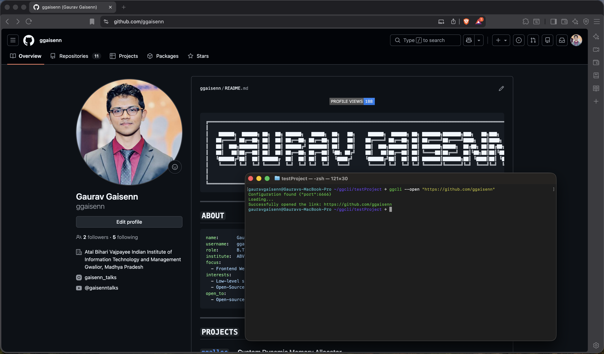
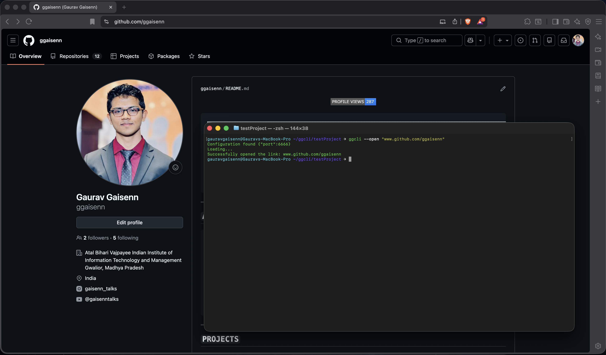
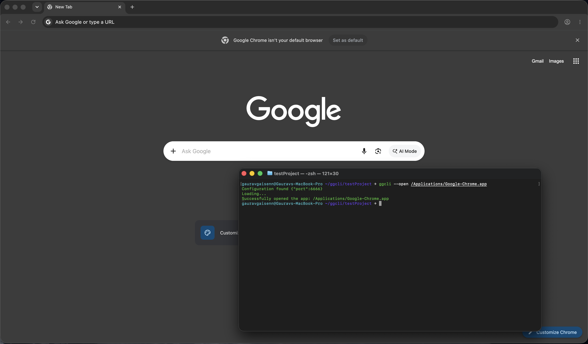
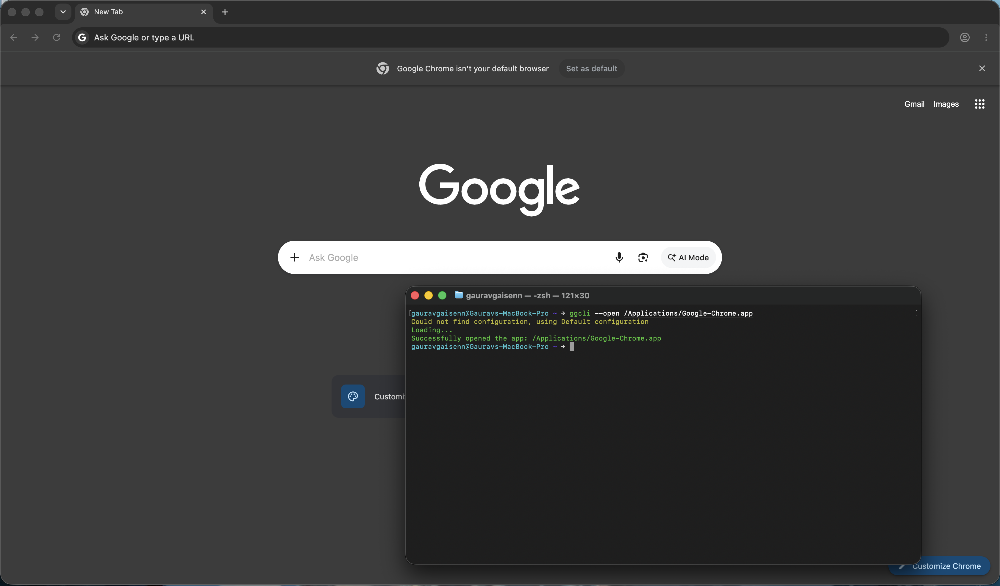

# ggcli

A Command Line Interface (CLI) tool built using Node.js that enables users to launch web links and local applications. It features dynamic configuration loading via `cosmiconfig`, robust configuration validation using `ajv` schemas, detailed validation error formatting with `better-ajv-errors`, and namespace-based console logging.

---

## What Does It Do?

`ggcli` processes CLI flags, dynamically searches the user's directory tree for configuration files (like `gg-cli.config.js`), validates the configurations against a strict JSON Schema definition, and routes actions to command modules. 

It can also launch your targeted apps (Only on macOS) or URLs (Cross-Platform). 

Before firing anything up, it acts as a safety net: it automatically checks if your URLs are formatted correctly and verifies that local apps are actually installed on your machine, preventing frustrating silent failures.

---

## Architecture

```
User CLI Command:  ggcli --open <APP_PATH/URL_LINK>
                           │
                           ▼
                  [ Parse Arguments ] (arg)
                           │
                 ┌─────────┴─────────┐
          (Success)                  (Failure / --help)
                 │                           │
                 ▼                           ▼
        [ Load Config ] (cosmiconfig)   [ Show Help ]
                 │
                 ▼
        [ Validate Config ] (ajv)
        ┌────────┴────────┐
     (Valid)          (Invalid)
        │                 │
        ▼                 ▼
   [ Run Command ]   [ Exit with Error ] (better-ajv-errors)
   (command/open.js)
        │
        ├───► [Empty target] ──► [Return with Error]
        |
        ├───► [ Is it a URL? ] ──────(Yes)──────► [ Validate URL Syntax ]
        │                                                   │
        └───► (No)                               ┌──────────────────────┐
               │                                 │                      │  
               ▼                                 ▼                      ▼
      [ Check commandExists() ]         [ Wait openPackage()]    [ Error? Log Exception ]
        ┌──────┴──────┐                          |
     (True)        (False)                       ▼          
        │             │               [Load URL in Default Browser]
        ▼             ▼
  [ Launch App ]   [ Log App Missing Error ]
```

The config loader uses the following JSON schema mapping:

```json
{
  "$schema": "http://json-schema.org/draft-07/schema#",
  "type": "object", 
  "properties": {
    "port": {
      "type": "number"
    },
    "targetApp": {
      "type": "string"
    }
  },
  "required": ["port"]
}
```

---

## Core Components

### `index.js` — CLI Entry Point & Flag Parser

1. Uses `arg` to parse the CLI input flags:
   - `--open <APP_PATH/URL_LINK>`: Triggers config loading and launches a browser URL or a local machine application based on user configuration.
   - `--buildcheck`: Runs status diagnostics.
   - `--help`: Outputs the CLI manual and options guide.

2. Wraps execution in a try-catch block to handle invalid flag entries, url links, local application paths, logging errors in red and falling back to the help guide.

### `getConfig()` — Config Resolver & Schema Validator (`config/config.js`)

1. Uses `cosmiconfig` to search upwards from `process.cwd()` to find a config file named `.gg-clirc`, `gg-cli.config.js`, or similar.
2. Uses `Ajv` to validate the found configuration.
3. If schema validation fails, prints clean, human-readable schema errors to the console using `better-ajv-errors` and terminates the process with `process.exit(1)`.
4. If no configuration is discovered, issues a warning and defaults to `{ port: 1234 }`.

### `open(config)` — Cross-Platform Application & URL Launcher (`command/open.js`)

Receives the validated configuration object and attempts to open the specified `targetApp` property:
1. **URL Validation**: Detects if the target starts with `http://` or `https://` and verifies its syntax using the native `URL` constructor.
2. **Local App Verification**: If it isn't a web link, it safely utilizes `command-exists` to confirm the application binary or directory path exists on the host machine before launching.
3. **Cross-Platform Execution**: Safely spawns the target using the underlying `open` system package, abstracting
OS-specific launcher variations with isolated error handling.

### `Logger(name)` — Terminal Theme Decorator (`logger.js`)

Provides unified terminal text formatting using `chalk` and namespace-based execution traces using the `debug` utility:
- **`log(...)`** — Green messages for successful actions.
- **`warning(...)`** — Yellow messages for warnings or default fallbacks.
- **`highlight(...)`** — Blue messages for help listings.
- **`error(...)`** — Red messages for execution exceptions.
- **`debug(...)`** — Namespace-specific debug logs (active only when running with `DEBUG=...` environment variables).
---

## Current Status

| Step | Feature                                        | Status  |
| ---- | --------------------------------------------   | ------  |
| 1    | Script binary entry (`bin/index.js`)           |  Done   |
| 2    | Command-line arguments parsing (`arg`)         |  Done   |
| 3    | Custom logging with color themes (`chalk`)     |  Done   |
| 4    | Launcher command logic (`open`)                |  Done   |
| 5    | Configuration file search (`cosmiconfig`)      |  Done   |
| 6    | Global package execution links (`npm link`)    |  Done   |
| 7    | Custom JSON Schema configuration rules         |  Done   |
| 8    | Schema-based verification (`ajv`)              |  Done   |
| 9    | Better validation logs (`better-ajv-errors`)   |  Done   |
| 10   | Namespace debugging flag (`debug`)             |  Done   |
| 11	 | Cross-platform URL format validation	          |  Done   |
| 12	 | Host system local app check (`command-exists`) |  Done   |
| 13   | `www.` protocol handling                       |  Done   |
| 14   | Cross-Platform App launcher                    | Process |
|      |---------- MORE FEATURES COMING SOON -----------|         |

---

## File Structure

```
gg-cli/
  |── package.json          # Root package script hooks
  |── tool/                 # Core CLI source directory
  |   ├── bin/
  |   │   └── index.js      # Shebang entry point, argument parsing, & routing
  |   ├── src/
  |   │   ├── command/
  |   │   │   └── open.js   # Launcher command module
  |   │   ├── config/
  |   │   │   ├── config.js # cosmiconfig resolver & ajv validation
  |   │   │   └── schema.json # Configuration schema layout
  |   │   └── logger.js     # Chalk decorator & debug namespace logger
  |   └── package.json      # CLI dependencies (ajv, chalk, debug, package-up)
  |── testProject/          # To Test the CLI
      ├── gg-cli.config.js  # User-Defined Configuration to test cosmiconfig
```

---

## Build & Run

### Prerequisites
- Node.js (v18+)

### 1. Installation
Clone the repository, then install project and tool dependencies:

```bash
# Navigate to the workspace
cd gg-cli

# Install dependencies for the tool
cd tool && npm install
```

### 2. Execution

You can run the script files directly via `node`:

```bash
# Display the help guide
node tool/bin/index.js --help

# Run a buildcheck validation
node tool/bin/index.js --buildcheck

# Open the app using the configuration loader
node tool/bin/index.js --open <APP_PATH/URL_LINK>
```

### 3. Testing with Configurations

To see the schema validation and configuration locator in action:

```bash
# Change directory to the test project
cd testProject

# Run the CLI from the context of testProject (loads testProject/gg-cli.config.js)
node ../tool/bin/index.js --open <APP_PATH/URL_LINK>
```

### 4. Linking Globally
To register the tool globally on your system, linking it to the `ggcli` executable name:

```bash
# Inside the tool directory
cd tool
npm link

# Run globally from any directory
ggcli --help
ggcli --open <APP_PATH/URL_LINK>
```
---
## Important Notes on Launching Targets

To ensure `ggcli` resolves your targets correctly without throwing execution exceptions, please review the formatting guidelines below.

### 🌐 Web Links & URLs

* **Valid Format**: `"https://www.youtube.com"`, `"www.youtube.com"` or `"http://localhost:3000"`

> Note: Web domains starting with `www.` is valid (eg.`"www.youtube.com"`)

---

### 🖥️ Local Desktop Applications 

* **Valid Format (Absolute Path)**: `"/Applications/Slack.app"` *(macOS)*
* **Invalid Format**: `"Slack"`


---

## Demo

Here is how `ggcli` behaves when launching targets, managing smart fallbacks, and handling configuration errors.

### 1. Launching a Web Link



### 2. Launching a Web Link without Protocol Prefix



### 3. Launching a Local Machine App (Only Works on macOS)



### 4. Smart Configuration Fallbacks




## Concepts Demonstrated

- **Safe Execution**: Built a reliable way to open web links or local apps. It validates URLs and checks if an app actually exists on your computer before trying to run it, preventing silent crashes.
- **Real-Deal Terminal Tools**: Turned a standard script into a native command-line tool using #!/usr/bin/env node
- **Smart Config Hunting**: Used cosmiconfig to let the tool automatically search up through folders to find your configuration files, meaning users don't have to constantly point to where their settings are.
- **Validation**: Integrated ajv to check configuration files at runtime. If a setting is broken, the tool catches it instantly before it can crash anything down the line.
- **Modern JS Layout**: Kept the codebase clean and future-proof by using native Node.js ES Modules (import/export and "type": "module").
- **Logs You Can Actually Read**: Used chalk and better-ajv-errors that is used to provide clean, color-coded messages that actually tell you what went wrong.
- **Toggled Debugging**: Set up structured logging namespaces so you can easily turn on clean, isolated trace logs whenever you're hunting down a bug.

